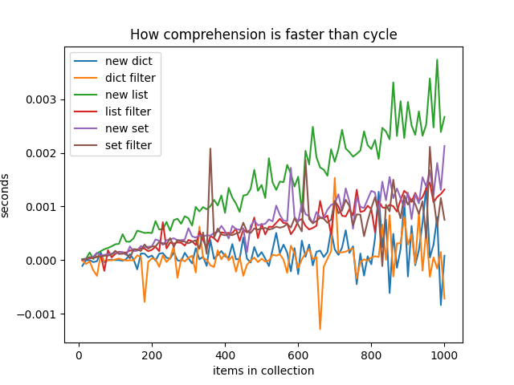
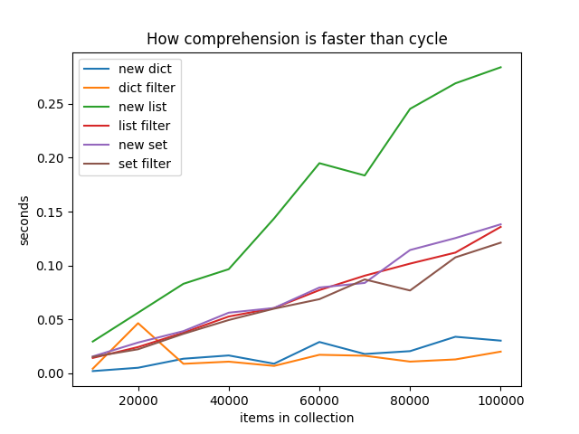

# Python comprehensions vs cycles

Almost whole python programmers know that there are list comprehensions [PEP 202](https://www.python.org/dev/peps/pep-0202/). 

```python
# create list of odd numbers with cycle
a = []
for i in range(10):
    if i % 2:
        a.append(i)
    
# create same collection using list comprehension
a = [i for i in range(10) if i % 2]
```

It isn’t only syntax sugar, comprehensions have CPython code optimisations and work faster. But what benefits do they provide? Let’s try to evaluate this.

I wrote a simple python program to compare execution for operation create collections using cycles and comprehensions. We will check `dict`, `list` and `set`. Base class for benchmarking has methods

```python
from typing import Dict, List, Set

class BaseBench:

    def __init__(self, n: int = 1) -> None:
        self.n = n

    def get_new_dict(self) -> Dict[int, str]:
        raise NotImplementedError

    def get_filtered_dict(self, data: Dict[int, str]) -> Dict[int, str]:
        raise NotImplementedError

    def get_new_set(self) -> Set[int]:
        raise NotImplementedError

    def get_filtered_set(self, data: Set[int]) -> Set[int]:
        raise NotImplementedError

    def get_new_list(self) -> List[int]:
        raise NotImplementedError

    def get_filtered_list(self, data: List[int]) -> List[int]:
        raise NotImplementedError
```

I write here a part of code, example only for `dict`. Other listings we can find in [github]():

```python
class CycleBench(BaseBench):

    def get_new_dict(self) -> Dict[int, str]:
        result = {}
        for i in range(self.n):
            if i % 2:
                result[i] = 'odd'
            else:
                result[i] = 'even'
        return result

    def get_filtered_dict(self, data: Dict[int, str]) -> Dict[int, str]:
        result = {}
        for key, value in data.items():
            if key % 2:
                result[key] = value
        return result
    

class ComprehensionBench(BaseBench):

    def get_new_dict(self) -> Dict[int, str]:
        return {i: 'odd' if i % 2 else 'even' for i in range(self.n)}

    def get_filtered_dict(self, data: Dict[int, str]) -> Dict[int, str]:
        return {key: value for key, value in data.items() if key % 2}
```

It’s interesting to check comprehension efficiency with different sizes of collections, small [10-1000] and big [10k-100k].





We see that more efficiency of comprehension is for `list`, and there is minimal time difference for `dict`.

## Conclusion

Yes, comprehension is faster and often does code more readable. But it is not a rule «always use comprehension». For some cases cycles are better. For example sometimes maintainability may be more important than performance.