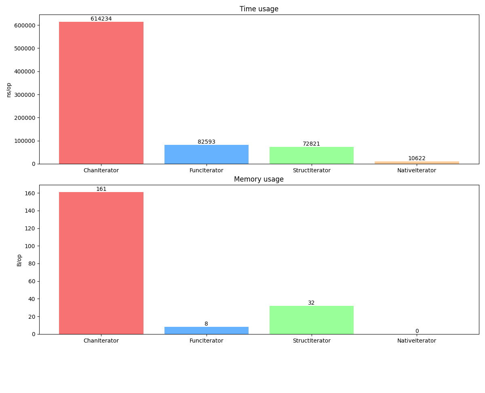

# Generators in Go v2 #blog

This post is an update of my old version [Generators in Go](https://z0rr0.blog/go-generators) post. On August 13th, the Go 1.23 release introduced a new feature: [iterators have been added](https://go.dev/doc/go1.23#iterators) to the language. Therefore, I would like to compare their convenience and performance with my previous implementations.

GPT

I am intentionally skipping basic error checks, such as handling a negative step, just to keep the code concise. However, please do not omit these checks in production versions.

## Channel

The first approach utilizes a Go channel. This is a straightforward example that employs a closure to iterate over values within an anonymous function.

```go
// ChanIterator is a range generator using a channel.
func ChanIterator(start, stop, step int) chan int {
    c := make(chan int, 1) // add small to improve performance
    
    go func() {
        for i := start; i < stop; i += step {
            c <- i
        }
        close(c)
    }()
    
    return c
}

// usage
chanIterator := ChanIterator(5, 20, 3)
for j := range chanIterator {
    fmt.Printf("%d ", j)
}
// output: 5 8 11 14 17
```

## Function

The next example is also based on an anonymous function, but it requires a specific predefined error as a stop condition. Additionally, mutexes are necessary to ensure thread-safe usage.

```go
// ErrStopIteration is an error to indicate the end of the iteration.
var ErrStopIteration = errors.New("stop iteration")

// FuncIterator is a function closure int-value iterator.
func FuncIterator(start, stop, step int) func() (int, error) {
    var (
		m sync.Mutex
		i = start
	)
    return func() (int, error) {
        m.Lock()
        defer func() {
            i += step
            m.Unlock()
        }()
        
		if i >= stop {
            return 0, ErrStopIteration
        }
        
		return i, nil
    }
}

// usage
funcIterator := FuncIterator(5, 20, 3)
for j, err := funcIterator(); err == nil; j, err = funcIterator() {
     fmt.Printf("%d ", j)
}
// output: 5 8 11 14 17
```

## Structure

To maintain internal state, you can use a structure instead of an anonymous function. In this case, the completion flag is of type `bool`. A similar approach could have been used in the previous example as well, but both options (using `error` or `bool`) seem more illustrative to me.

```go
// StructIterator is a struct to iterate over a range of integers.
type StructIterator struct {
	sync.Mutex
	current int
	stop    int
	step    int
}

// Next returns a new generation value and flag that it is not the end.
func (g *StructIterator) Next() (int, bool) {
	defer func() {
		g.Lock()
		g.current += g.step
		g.Unlock()
	}()
	return g.current, g.current < g.stop
}

// usage
structIterator := &StructIterator{current: 5, stop: 20, step: 3}
for j, ok := structIterator.Next(); ok; j, ok = structIterator.Next() {
     fmt.Printf("%d ", j)
}
// output: 5 8 11 14 17
```

## Iterator (since Go 1.23)

Starting with Go 1.23, it is now possible to create functional variables that can be used natively in a `for/range` loop. This functional style is somewhat unconventional for Go and can be challenging to read at first, but its use is justified by the simplicity it brings.

```go
// NativeIterator is a native iterator for go since 1.23
func NativeIterator(start, stop, step int) iter.Seq[int] {
	return func(yield func(int) bool) {
		for i := start; i < stop; i += step {
			if !yield(i) {
				return
			}
		}
	}
}

// usage
nativeIterator := NativeIterator(5, 20, 3)
for j := range nativeIterator {
     fmt.Printf("%d ", j)
}
// output: 5 8 11 14 17
```

## Benchmarks

I wrote simple tests for iterators ranging from 1 to 10000 with a step of 2. Let’s take a look at the results for different types of structures.

```
goos: linux
goarch: amd64
pkg: go-generators-v2
cpu: Intel(R) Core(TM) i7-10510U CPU @ 1.80GHz
BenchmarkChanIterator-8      1742  614234 ns/op  161 B/op  2 allocs/op
BenchmarkFuncIterator-8     14692   82593 ns/op    8 B/op  1 allocs/op
BenchmarkStructIterator-8   16065   72821 ns/op   32 B/op  1 allocs/op
BenchmarkNativeIterator-8  112792   10622 ns/op    0 B/op  0 allocs/op
PASS
ok      go-generators-v2        6.414ss
```



## Conclusion

Test results show that the new native solution outperforms all others. While it may take some time to get accustomed to, this feature has been eagerly anticipated, so kudos to the Go team. It’s also important to note that implementing such iterators would not have been possible without generics. Thanks to this, iterators as syntactic sugar have also been immediately added to slices and maps in the [standard packages](https://go.dev/doc/go1.23#iterators).